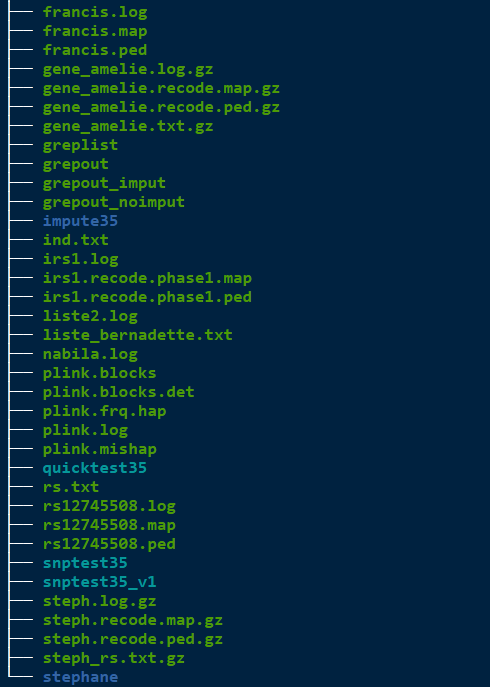

---
params:
  title: 'My Journey To Transparency And Reproducibility'
  shortitle: 'My Journey To Reproducibility'
  subtitle: '<i class = "fab fa-docker"></i> & <i class = "fab fa-r-project"></i>'
  author: 'Mickaël Canouil, *Ph.D.* (<a href = "http://m.canouil.fr/" target = "_blank"><i class = "fas fa-home"></i> m.canouil.fr</a>)'
  institute: "Inserm U1283 / CNRS UMR8199 / Institut Pasteur de Lille"
  date: !r format(Sys.Date(), "The %d of %B, %Y")
  theme: "mc"
output:
  xaringan::moon_reader:
    self_contained: TRUE
    css: [css/default.css, css/fonts.css]
    includes:
      after_body: css/scripts.html
    seal: false
    nature:
      highlightStyle: github
      highlightLines: true
      slideNumberFormat: | 
        <div class = "progress-bar-container">
          <div class = "progress-bar" style="width: calc(%current% / %total% * 100%);">
          </div>
        </div>
      ratio: "16:9"
      countIncrementalSlides: false
title: '`r params[["shortitle"]]`'
subtitle: '`r params[["subtitle"]]`'
author: '`r params[["author"]]`'
institute: '`r params[["institute"]]`'
date: '`r params[["date"]]`'
---

class: title-slide

```{css, echo = FALSE}
:root {
  --main-logo: url(https://raw.githubusercontent.com/mcanouil/hex-stickers/master/SVG/mc.svg);
}
.red { color: #b20000; }
.green { color: #00b200; }
.blue { color: #0000b2; }  
```

```{r setup, include = FALSE}
options("width" = 110)
options(htmltools.dir.version = FALSE)


### Load Packages ==================================================================================
suppressPackageStartupMessages({
  library(here)
  library(knitr)
  library(ragg)
  library(svglite)
  library(ggplot2)
  library(ggtext)
  library(patchwork)
  library(data.table)
  library(showtext)
})


### knitr settings =================================================================================
opts_chunk$set(
  eval = TRUE, # Default: TRUE
  include = TRUE, # Default: TRUE
  echo = TRUE, # Default: TRUE
  width = getOption("width"),
  comment = "#>", 
  fig.align = "center",
  fig.width = 11.5, # Default: 7
  fig.height = 5.75,  # Default: 7
  dpi = 150, # Default: 72
  dev = "svglite", # Alt: ragg_png
  dev.args = list(
    web_fonts = list("https://fonts.googleapis.com/css?family=Alegreya+Sans")
  )
)
font_add_google("Alegreya Sans", "Alegreya Sans", regular.wt = 300)
showtext_auto()


### Tables and Figures Theme =======================================================================
theme_black <- function(
  base_size = 11,
  base_family = "",
  base_line_size = base_size / 22,
  base_rect_size = base_size / 22,
  theme = "mc"
) {
  bc <- switch(EXPR = theme,
    "mc" = c("#333333", "#7F7F7F", "#FFFFFF"),
    "rlille" = c("#F2F2F2", "#CCCCCC", "#D40000")
  )
  half_line <- base_size / 2
  ggplot2::theme(
    line = ggplot2::element_line(
      colour = bc[3],
      size = base_line_size,
      linetype = 1,
      lineend = "butt"
    ),
    rect = ggplot2::element_rect(
      fill = bc[1],
      colour = bc[3],
      size = base_rect_size,
      linetype = 1
    ),
    text = ggplot2::element_text(
      family = base_family,
      face = "plain",
      colour = bc[3],
      size = base_size,
      lineheight = 0.9,
      hjust = 0.5,
      vjust = 0.5,
      angle = 0,
      margin = ggplot2::margin(),
      debug = FALSE
    ),
    title = NULL,
    aspect.ratio = NULL,

    axis.title = NULL,
    axis.title.x = ggplot2::element_text(margin = ggplot2::margin(t = half_line), vjust = 1),
    axis.title.x.top = ggplot2::element_text(margin = ggplot2::margin(b = half_line), vjust = 0),
    axis.title.x.bottom = NULL,
    axis.title.y = ggplot2::element_text(angle = 90, margin = ggplot2::margin(r = half_line), vjust = 1),
    axis.title.y.left = NULL,
    axis.title.y.right = ggplot2::element_text(angle = -90, margin = ggplot2::margin(l = half_line), vjust = 0),
    axis.text = ggplot2::element_text(size = ggplot2::rel(0.8), colour = bc[3]),
    axis.text.x = ggplot2::element_text(margin = ggplot2::margin(t = 0.8 * half_line / 2), vjust = 1),
    axis.text.x.top = ggplot2::element_text(margin = ggplot2::margin(b = 0.8 * half_line / 2), vjust = 0),
    axis.text.x.bottom = NULL,
    axis.text.y = ggplot2::element_text(margin = ggplot2::margin(r = 0.8 * half_line / 2), hjust = 1),
    axis.text.y.left = NULL,
    axis.text.y.right = ggplot2::element_text(margin = ggplot2::margin(l = 0.8 * half_line / 2), hjust = 0),
    axis.ticks = ggplot2::element_line(colour = bc[3]),
    axis.ticks.x = NULL,
    axis.ticks.x.top = NULL,
    axis.ticks.x.bottom = NULL,
    axis.ticks.y = NULL,
    axis.ticks.y.left = NULL,
    axis.ticks.y.right = NULL,
    axis.ticks.length = ggplot2::unit(half_line / 2, "pt"),
    axis.ticks.length.x = NULL,
    axis.ticks.length.x.top = NULL,
    axis.ticks.length.x.bottom = NULL,
    axis.ticks.length.y = NULL,
    axis.ticks.length.y.left = NULL,
    axis.ticks.length.y.right = NULL,
    axis.line = ggplot2::element_blank(),
    axis.line.x = NULL,
    axis.line.x.top = NULL,
    axis.line.x.bottom = NULL,
    axis.line.y = NULL,
    axis.line.y.left = NULL,
    axis.line.y.right = NULL,

    legend.background = ggplot2::element_rect(fill = bc[1], colour = NA),
    legend.margin = ggplot2::margin(half_line, half_line, half_line, half_line),
    legend.spacing = ggplot2::unit(2 * half_line, "pt"),
    legend.spacing.x = NULL,
    legend.spacing.y = NULL,
    legend.key = ggplot2::element_rect(fill = bc[1], colour = bc[3]),
    legend.key.size = ggplot2::unit(1.2, "lines"),
    legend.key.height = NULL,
    legend.key.width = NULL,
    legend.text = ggplot2::element_text(size = ggplot2::rel(0.8)),
    legend.text.align = NULL,
    legend.title = ggplot2::element_text(hjust = 0),
    legend.title.align = NULL,
    legend.position = "right",
    legend.direction = NULL,
    legend.justification = "center",
    legend.box = NULL,
    legend.box.just = NULL,
    legend.box.margin = ggplot2::margin(0, 0, 0, 0, "cm"),
    legend.box.background = ggplot2::element_blank(),
    legend.box.spacing = ggplot2::unit(2 * half_line, "pt"),

    panel.background = ggplot2::element_rect(fill = bc[1], colour = NA),
    panel.border = ggplot2::element_rect(fill = NA, colour = bc[3], size = 0.5, linetype = "solid"),
    panel.spacing = ggplot2::unit(half_line, "pt"),
    panel.spacing.x = NULL,
    panel.spacing.y = NULL,
    panel.grid = ggplot2::element_line(colour = bc[2]),
    panel.grid.major = ggplot2::element_line(colour = bc[2]),
    panel.grid.minor = ggplot2::element_line(colour = bc[2], size = ggplot2::rel(0.5)),
    panel.grid.major.x = NULL,
    panel.grid.major.y = NULL,
    panel.grid.minor.x = NULL,
    panel.grid.minor.y = NULL,
    panel.ontop = FALSE,

    plot.background = ggplot2::element_rect(colour = bc[1]),
    plot.title = ggplot2::element_text(
      size = ggplot2::rel(1.25),
      face = "bold",
      hjust = 0,
      vjust = 1,
      margin = ggplot2::margin(b = half_line)
    ),
    plot.title.position = "plot",
    plot.subtitle = ggplot2::element_text(
      size = ggplot2::rel(1),
      face = "italic",
      hjust = 0,
      vjust = 1,
      margin = ggplot2::margin(b = half_line)
    ),
    plot.caption = ggplot2::element_text(
      size = ggplot2::rel(0.75),
      face = "italic",
      hjust = 1,
      vjust = 1,
      margin = ggplot2::margin(t = half_line)
    ),
    plot.caption.position = "plot",
    plot.tag = ggplot2::element_text(size = ggplot2::rel(1.25), hjust = 0.5, vjust = 0.5),
    plot.tag.position = "topleft",
    plot.margin = ggplot2::margin(half_line, half_line, half_line, half_line),

    strip.background = ggplot2::element_rect(fill = bc[1], colour = bc[3]),
    strip.background.x = NULL,
    strip.background.y = NULL,
    strip.placement = "inside",
    strip.placement.x = NULL,
    strip.placement.y = NULL,
    strip.text = ggplot2::element_text(
      colour = bc[3],
      size = ggplot2::rel(0.8),
      margin = ggplot2::margin(0.8 * half_line, 0.8 * half_line, 0.8 * half_line, 0.8 * half_line)
    ),
    strip.text.x = NULL,
    strip.text.y = ggplot2::element_text(angle = -90),
    strip.switch.pad.grid = ggplot2::unit(half_line / 2, "pt"),
    strip.switch.pad.wrap = ggplot2::unit(half_line / 2, "pt"),

    complete = TRUE
  )
}
theme_set(theme_black(base_size = 18, base_family = "Alegreya Sans", theme = params[["theme"]]))
theme_update(
  plot.title.position = "plot",
  plot.caption.position = "plot",
  plot.title = element_markdown(),
  plot.subtitle = element_markdown(face = "italic", size = rel(0.80)),
  plot.caption = element_markdown(face = "italic", size = rel(0.65)),
  axis.title.x = element_markdown(),
  axis.text.x = element_markdown(),
  axis.title.y = element_markdown(),
  axis.text.y = element_markdown()
)

options(
  ggplot2.discrete.colour = function(...) scale_colour_viridis_d(..., begin = 0.15, end = 0.85),
  ggplot2.discrete.fill = function(...) scale_fill_viridis_d(..., begin = 0.15, end = 0.85),
  ggplot2.continuous.colour = function(...) scale_colour_viridis_c(..., begin = 0.15, end = 0.85),
  ggplot2.continuous.fill = function(...) scale_fill_viridis_c(..., begin = 0.15, end = 0.85)
)
```

<div class = "main-logo"></div><div class = "side-logo"></div>

# `r params[["title"]]`

## `r params[["subtitle"]]`

### `r params[["author"]]`

### `r params[["institute"]]`

### `r params[["date"]]`

---
class: part-slide

# Who Am I?


---

# Who Am I? .font50[(_Definitely Not Iron Man ..._)]

.pull-left[
* __Head of the Biostatistics Team__ of the __Inserm U1283 / CNRS UMR 8199__ unit _(Functional (Epi)genomics and Molecular Physiology of Diabetes and Related Diseases)_.  
    
    
* __Doctor of Philosophy (Ph.D.) in Biostatistics__.

* Authored __4 <i class = "fab fa-r-project"></i> packages__ on CRAN (more on Github).  
    
    
    
    
* Contributed to __2 <i class = "fab fa-r-project"></i> packages__ on CRAN.

* .font80[_Watched 2,850 movies so far ..._]
]

.pull-right[
.center[
  
_From_ `ggpacman` _on CRAN._  
_It's only an <i class = "fab fa-r-project"></i> package to make a GIF, sorry!_
]
]

---
class: part-slide

# Where My Journey Started?


---

# With A Project-oriented Workflow

---

# With A Project-oriented Workflow (_Or Not_)



--


--


--


--


--


---
class: part-slide

# Project Structure?

--


--

.font200[⇒ I can fix it!]

---

# Something Simple

.pull-left.font150[
* `Data`
* `Docs`
* `Report`
* `Scripts`
* `README.md`
]

.pull-right[

]

--

.center.font150.blue[
⇒ This solved one issue, but it was the obvious one ...
</br>
_i.e._, data, scripts, and outputs should not live in the same directory!
]

--

.pull-left.font150[
* `.git` ⇒ Let's add GIT, it can't hurt!<sup>&ast;</sup>
]

.pull-right[

]

--

.footnote[
&ast; It did a little bit more than the project structure.
]

---
class: part-slide
background-image: url(https://source.unsplash.com/zFYUsLk_50Y)
background-size: cover

```{css, echo = FALSE}
.bg-img {
  text-shadow: 2px 2px 5px #000000
}
```


# .bg-img[Infrastructure System]

---

# Infrastructure System

<div style = "font-size: 1000%; color: #333; position: absolute; top: 35%; left: 42%;">
  <i class = "fas fa-server"></i>
</div>

--

<div style = "font-size: 500%; color: #333; position: absolute; top: 45%; left: 5%;">
  <i class="fas fa-user" ></i><i class="fas fa-desktop"></i>
</div>
<div style = "font-size: 400%; color: #333; position: absolute; top: 47%; left: 29%;">
  <i class="fas fa-arrows-alt-h"></i>
</div>

--

<div style = "font-size: 500%; color: #333; position: absolute; top: 45%; left: 78%;">
  <i class="fas fa-user" ></i><i class="fas fa-desktop"></i>
</div>
<div style = "font-size: 400%; color: #333; position: absolute; top: 47%; left: 65%;">
  <i class="fas fa-arrows-alt-h"></i>
</div>
<div style = "font-size: 500%; color: #333; position: absolute; top: 12%; left: 42%;">
  <i class="fas fa-user" ></i><i class="fas fa-desktop"></i>
</div>
<div style = "font-size: 400%; color: #333; position: absolute; top: 27.5%; left: 48%;">
  <i class="fas fa-arrows-alt-v"></i>
</div>
<div style = "font-size: 500%; color: #333; position: absolute; top: 79%; left: 42%;">
  <i class="fas fa-user" ></i><i class="fas fa-desktop"></i>
</div>
<div style = "font-size: 400%; color: #333; position: absolute; top: 66.5%; left: 48%;">
  <i class="fas fa-arrows-alt-v"></i>
</div>

--

<div style = "font-size: 150%; color: #0000b2; position: absolute; top: 49%; left: 13.75%;">
  <i class="fab fa-r-project"></i>
</div>
<div style = "font-size: 150%; color: #b20000; position: absolute; top: 52%; left: 18%;">
  <i class="fab fa-python"></i>
</div>
<div style = "font-size: 150%; color: #0000b2; position: absolute; top: 49%; left: 86.75%;">
  <i class="fab fa-r-project"></i>
</div>
<div style = "font-size: 150%; color: #b20000; position: absolute; top: 52%; left: 91%;">
  <i class="fab fa-python"></i>
</div>
<div style = "font-size: 150%; color: #0000b2; position: absolute; top: 16.25%; left: 50.75%;">
  <i class="fab fa-r-project"></i>
</div>
<div style = "font-size: 150%; color: #b20000; position: absolute; top: 19.25%; left: 55%;">
  <i class="fab fa-python"></i>
</div>
<div style = "font-size: 150%; color: #0000b2; position: absolute; top: 83.25%; left: 50.75%;">
  <i class="fab fa-r-project"></i>
</div>
<div style = "font-size: 150%; color: #b20000; position: absolute; top: 86.25%; left: 55%;">
  <i class="fab fa-python"></i>
</div>

--

<div style = "font-size: 200%; color: #0000b2; position: absolute; top: 51%; left: 44%;">
  <i class="fab fa-r-project" style = "color: #0000b2;"></i>
  <i class="fab fa-python" style = "color: #b20000;"></i>
</div>
<div style = "font-size: 400%; color: #333; position: absolute; top: 45.45%; left: 14.5%;">
  <i class="fas fa-times"></i>
</div>
<div style = "font-size: 400%; color: #333; position: absolute; top: 45.45%; left: 87.5%;">
  <i class="fas fa-times"></i>
</div>
<div style = "font-size: 400%; color: #333; position: absolute; top: 12.6%; left: 51.5%;">
  <i class="fas fa-times"></i>
</div>
<div style = "font-size: 400%; color: #333; position: absolute; top: 79.6%; left: 51.5%;">
  <i class="fas fa-times"></i>
</div>

--

<div style = "font-size: 150%; position: absolute; top: 20%; left: 8%;">
⇒ Non-root users.
</div>

--

<div style = "font-size: 150%; color: #b20000; position: absolute; top: 20%; left: 67%;">
⇒ Not possible to install <i class = "fab fa-r-project"></i> packages or system libraries.
</div>

--

<div style = "font-size: 150%; position: absolute; top: 75%; left: 8%;">
⇒ Possible to install</br>
<i class = "fab fa-r-project"></i> packages in user `home`.
</div>

--

<div style = "font-size: 150%; color: #b20000;  position: absolute; top: 75%; left: 67%;">
⇒ Limited storage in `home`. </br>
<i>Not a good place anyway ...</i>
</div>

---

# Lack Of A Reproducible Environment

.font150[

.pull-left[
+ __Code errors__  
    The same code can give different results on different platforms/machines.
]

.pull-right[
+ __Affecting multiple projects__  
    In a global and shared environment, any changes in system libraries and <i class = "fab fa-r-project"></i> packages can change or crash any unrelated projects.
]

.pull-left[  
+ __Difficult system deployment (for user/developer)__  
    Establishing and maintaining infrastructure is challenging if not tracked properly, especially over time.
]

.pull-right[
+ __Painful collaboration__  
    Team/User will most likely waste time setting up new environment rather than starting developing.
]

]

---
class: part-slide

# Reproducible Development/Analysis Workflow</br>With</br>Docker</br><i class = "fab fa-docker" style = "font-size: 400%;"></i>

---

# Build A Container With A Dockerfile


--


--

```{css, echo = FALSE}
.text-block {
  position: absolute;
  bottom: 5%;
  right: 5%;
  background-color: var(--bg-colour);
  color: var(--font-colour);
  float: right;
  width: 40%;
  box-shadow: 3px 5px 3px 1px #ffffff80;
}
```


.text-block[
* More than __100 <i class = "fab fa-r-project"></i> packages__ pre-installed.  
    ⇒ Increasing over time to ensure "old" projects still work.
* Still no way to install <i class = "fab fa-r-project"></i> packages without compromising the transparency/reproducibility of the Dockerfile used.
]

---

# What Do We Have Now?

.pull-left.green[

* .font150[__Good__]

    + A project structure __clear__.
  
    + __Flexibility at the system-level__ using a Dockerfile to build an image with <i class = "fab fa-r-project"></i> packages or any needed libraries.
    
    + __Reproducibility__, _i.e._, a project analysed using a specific Docker <i class = "fab fa-docker"></i> image can be re-analysed using that same Docker image.
    
]

.pull-right.red[
* .font150[__Bad__]

    + Requires some __knowledge__ about system administration and Docker <i class = "fab fa-docker"></i>.
    
    + New __<i class = "fab fa-r-package"></i> packages cannot be installed__ without having to build a new Docker <i class = "fab fa-docker"></i> image.
    
    + <i class = "fab fa-r-package"></i> packages are __not project-specific__, unless you create a Docker <i class = "fab fa-docker"></i> image for each.
    
    + To build or run Docker, users are __required to be `root`__.
    
]

.center.blue[
.font150[
⇒ What if there is a way to __install any__ <i class = "fab fa-r-package"></i> __packages__ (_and Python <i class = "fab fa-python"></i> modules_),  to __record versions__, and to be able to automatically __restore/reinstall all the__ <i class = "fab fa-r-package"></i> __packages of a specific project__?
]
.font120[
All that without any "interference" with the system (_e.g._, Docker container, laptop, _etc._).
]
]

---
class: part-slide

# 


---

```{css, echo = FALSE}
.bqm {
  border-left: solid 5px var(--font-colour);
  padding-left: 1em;
}
.sign {
  float: right;
  width: 25%;
}
```

# What Is `renv`?

.bqm.font120[

The `renv` package helps you create __r__eproducible __env__ironments for your <i class = "fab fa-r-project"></i> projects.

Use `renv` to make your R projects more:

* __Isolated__: Installing a new or updated package for one project won’t break your other projects, and vice versa.  
    That’s because `renv` gives each project its own private package library.

* __Portable__: Easily transport your projects from one computer to another, even across different platforms.  
    `renv` makes it easy to install the packages your project depends on.

* __Reproducible__: `renv` records the exact package versions you depend on, and ensures those exact versions are the ones that get installed wherever you go.

.sign[
[https://rstudio.github.io/renv/](https://rstudio.github.io/renv/)
]

]

---

# How Does `renv` Work?

---

# Docker <i class = "fab fa-docker"></i> & `renv`


--


---

# What Do We Have Now?

.pull-left.green[

* .font150[__Good__]

    + A project structure __clear__.
  
    + __Flexibility at the system-level__ using a Dockerfile to build an image with system libraries.
    
    + __Flexibility at the project-level__ using  `renv`.
        + New __<i class = "fab fa-r-package"></i> packages can be installed/restored__ without having to build a new Docker <i class = "fab fa-docker"></i> image.
        + <i class = "fab fa-r-package"></i> packages are __project-specific__.
    
    + __Reproducibility__, _i.e._, Docker + `renv`.  
        The underlying system, its dependencies, and required <i class = "fab fa-r-package"></i> packages, are fixed and constant for a particular project.
    
]

.pull-right.red[
* .font150[__Bad__]

    + Requires some __knowledge__ about system administration and Docker <i class = "fab fa-docker"></i>.
    
    + To build or run Docker, users are __required to be `root`__.
    
]

---

# How To Reduce Cognitive Load For New Users?

+ .font150[Remaining issues]

    + Having to learn about system administration (_i.e._, Debian, Ubuntu, MacOS, Windows, _etc._) __can be a hassle__, especially for beginners.

    + Mostly for security reasons, __users should not be `root`__ for day-to-day work (or in general).

--

+ .font150[Solutions] 

    + ⇒ Build a Docker image with RStudio server, <i class = "fab fa-r-project"></i>, and with "all" required system libraries (Docker containers as a _daemon_).
        + A user has __a non-root account__ to log in through a web browser to the IDE (_i.e._, RStudio).
        + A user __can develop, code an analysis__ in a shared environment with a __project-oriented workflow__ built around `renv`.
        + __No prior knowledge__ about Docker is required.
        + Scripts can still be launched directly in Docker without a _daemon_.
    
    + ⇒ __Singularity__ ([](https://sylabs.io/singularity/)) to run containers __without root privileges__, including Docker containers.

---
class: part-slide

# 


---
class: part-slide

# What Do We Have Now?


---
class: part-slide

# 

.pull-left[
<a href = "" target = "_blank"><i class = "fas fa-phone"></i> +33 (0) 374 00 81 29</a> 
]

.pull-right[
<a href = "mailto:mickael.canouil@cnrs.fr" target = "_blank"><i class = "fas fa-envelope"></i> mickael.canouil@cnrs.fr</a> 
]

.center[
<a href = "http://m.canouil.fr" target = "_blank"><i class = "fas fa-home"></i> m.canouil.fr</a>

<a href = "https://github.com/mcanouil/" target = "_blank"><i class = "fab fa-github"></i> mcanouil</a>

<a href = "https://rlille.fr" target = "_blank"><i class = "fab fa-r-project"></i> rlille.fr</a> 
]

.pull-left[
<a href = "https://www.linkedin.com/in/mickael-canouil/" target = "_blank"><i class = "fab fa-linkedin"></i> mickael-canouil</a> 
]

.pull-right[
<a href = "https://twitter.com/mickaelcanouil/" target = "_blank"><i class = "fab fa-twitter"></i> @mickaelcanouil</a>
]
